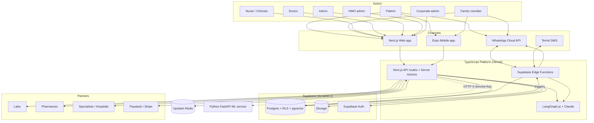
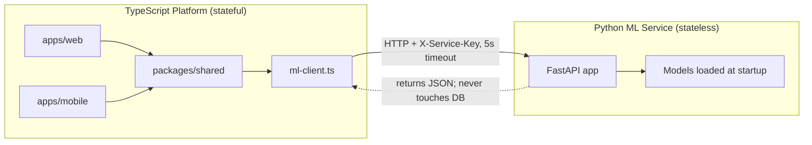
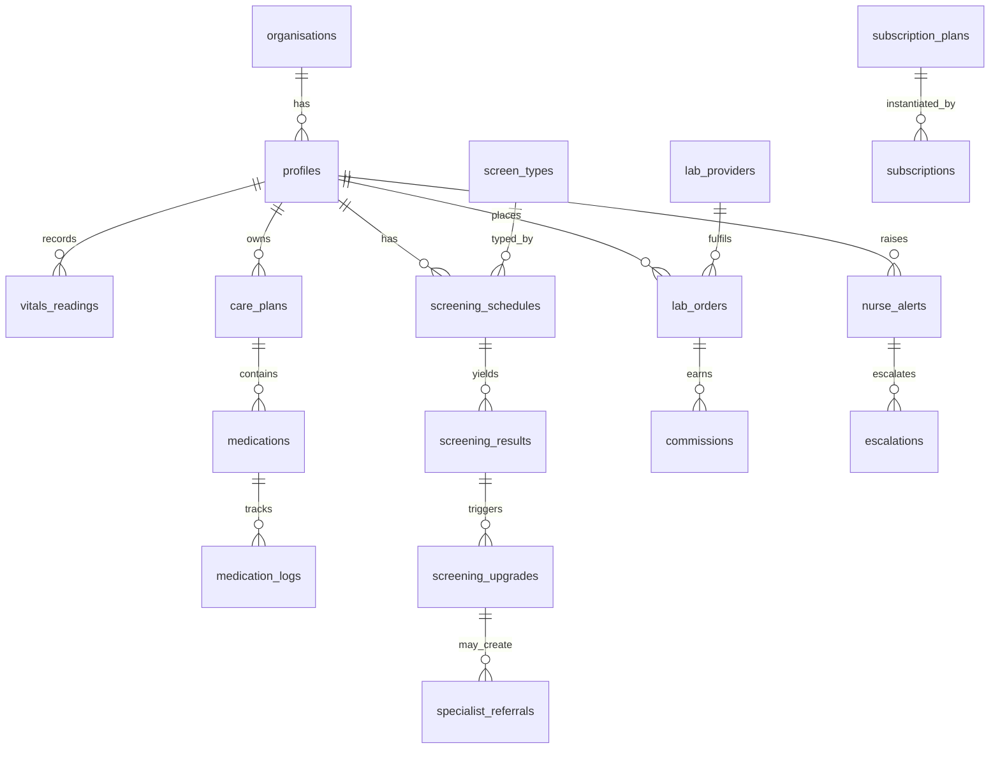
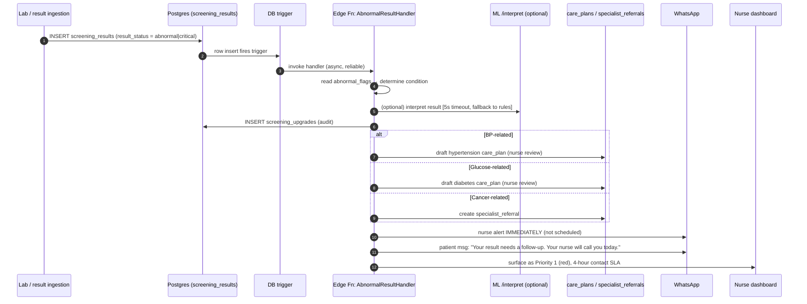
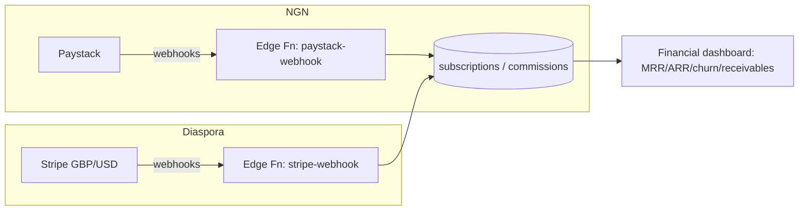

# Tarragon Health — System Architecture

> The authoritative technical architecture for the platform. Business/product source of truth: `docs/FEATURE_SPEC.md`. Per-session operating contract: `CLAUDE.md`. Brand: `docs/BRAND_GUIDE.md`.
>
> Stack is **Stack A — final** (Next.js/TypeScript/Supabase + a stateless Python FastAPI ML microservice). This document turns the feature spec into a concrete, buildable system design and records the architectural decisions and their rationale.

---

## 1. Architectural Principles (non-negotiable)

These derive directly from `CLAUDE.md` and shape every decision below.

1. **Two layers, one boundary.** A TypeScript platform owns all state, auth, and business logic. A Python ML service is **stateless**, has **no database access**, and only ever receives data in the request body over HTTP. The platform must keep working if ML is down.
2. **Multi-tenant by construction.** Every domain table carries `organisation_id`. Tenant isolation is enforced by **Postgres Row-Level Security (RLS)** — never in application code, never bypassed "just for this query".
3. **WhatsApp is a first-class channel, not an add-on.** Every patient-facing capability must work via WhatsApp/SMS **and** app/web. No feature ships app-only.
4. **The abnormal-result event is sacred.** A screening result of `abnormal|critical` triggering a Category 1 upgrade is the highest-priority event in the system. It must be immediate, reliable, and auditable — never lost, never silently swallowed.
5. **Money is exact.** All NGN stored in **kobo** (integer). Diaspora billing in GBP (primary) / USD (secondary) via Stripe.
6. **Data residency + compliance first.** Supabase Postgres in **`eu-west-1`** (Supabase has no Africa region; closest available to Nigeria, NDPR residency gap accepted for now). Immutable audit log for every clinical, billing, and ML event.
7. **Everything typed.** TypeScript strict, no `any`, Zod at every API boundary. Python 3.12, Pydantic v2 at every ML endpoint.

---

## 2. Technology Stack (locked)

| Concern | Choice | Notes |
|---|---|---|
| Monorepo | **pnpm workspaces + Turborepo** | pnpm only — never npm/yarn |
| Web | **Next.js 16**, TypeScript, Tailwind v4, shadcn/ui | `apps/web`. (Note: repo is on Next.js **16**, not 15 as older docs said — 16 is the decision of record. This Next.js has breaking changes vs. training data — read `node_modules/next/dist/docs/` before writing framework code, per `AGENTS.md`.) |
| Mobile | React Native **Expo** | `apps/mobile` |
| DB / Auth / Storage / Realtime | **Supabase Postgres**, `eu-west-1`, pgvector | RLS enforced platform-wide; NDPR residency gap accepted (no Supabase Africa region) |
| Edge compute | Supabase **Edge Functions** (Deno) | Triggers, webhooks, the abnormal-result handler |
| Cache / queues / conversation state | **Upstash Redis** | WhatsApp conversation state lives here, not Postgres |
| AI orchestration | **LangGraph.js + Claude API** | Clinical workflows, summaries, triage support |
| ML microservice | **Python 3.12 + FastAPI 0.115+**, uv | `services/ml` — stateless, standalone |
| Comms | **WhatsApp Cloud API** (primary), **Termii SMS** (fallback) | E.164 numbers, `Africa/Lagos` tz |
| Payments | **Paystack** (NGN), **Stripe** (GBP/USD) | Kobo storage, webhook-driven |
| Hosting | **Vercel** (web + Edge), **Railway/Render** (ML — TBD), **Cloudflare** (DNS/edge) | ML host not yet provisioned |
| Shared types/client | `packages/shared` | Zod schemas, DB types, typed `ml-client.ts` |

---

## 3. System Context



---

## 4. Two-Layer Topology & Service Boundary



**Contract rules (`packages/shared/ml-client.ts`):**
- TypeScript → ML over HTTP only, base `ML_SERVICE_URL`, auth header `X-Service-Key` (`ML_SERVICE_KEY`).
- **5-second timeout, graceful fallback.** The client **never throws** — returns `null` on error/timeout. Every caller must have a non-ML fallback path (e.g. rule-based risk score).
- ML service **never** imports from `apps/` or `packages/`, **never** reads the DB, **never** writes files. All patient data arrives in the request body.

---

## 5. Monorepo Layout

```
tarragonhealth/
├─ apps/
│  ├─ web/                 # Next.js 16 (App Router) — patient/nurse/doctor/admin/HMO/corporate UIs
│  └─ mobile/              # React Native Expo
├─ services/
│  └─ ml/                  # FastAPI 0.115+, Python 3.12, uv — stateless ML microservice
├─ packages/
│  └─ shared/              # Zod schemas, generated DB types, ml-client.ts, constants (kobo, tz, enums)
├─ supabase/
│  ├─ migrations/          # SQL migrations (schema + RLS policies)
│  ├─ functions/           # Edge Functions (AbnormalResultHandler, whatsapp-webhook, paystack-webhook…)
│  └─ seed/                # screen_types, lab/pharmacy partners, panel bundles
├─ docs/                   # ARCHITECTURE.md, FEATURE_SPEC.md, BRAND_GUIDE.md
├─ brand/                  # logo assets
├─ turbo.json
├─ pnpm-workspace.yaml
└─ package.json
```

Rationale: Turborepo gives cached, parallel builds and a single dependency graph; pnpm workspaces keep `packages/shared` as the single source of truth for types shared between web, mobile, and (via generated OpenAPI types) the ML client. The Python service lives in the repo for co-location and CI but is fully standalone at runtime.

---

## 6. Data Architecture

### 6.1 Multi-Tenancy & RLS Model

Every domain table has `organisation_id uuid not null`. `profiles` links to `auth.users` and carries a `role` enum. RLS policies keyed on `auth.uid()` and the caller's `organisation_id`/role:

| Role | Can see |
|---|---|
| `patient` | Own rows only |
| `nurse` / `clinician` | Patients within their `organisation_id` |
| `hmo_admin` | Their HMO's member patients |
| `corporate_admin` | Their enrolled employees |
| `admin` (super) | All rows |

Isolation invariant (tested at launch gate): **a nurse in Org A querying Org B patients returns 0 rows.** No service-role key in client contexts; the anon/authenticated key + RLS is the default path. Service-role usage is confined to trusted server/Edge contexts and audited.

### 6.2 Schema Domains

Grouped per `FEATURE_SPEC.md §3`. All five categories are created in Sprint 1 — changing the schema later is expensive.



- **Core/Auth (§3.1):** `profiles`, `organisations`.
- **Chronic (§3.2):** `vitals_readings`, `care_plans`, `medications`, `medication_logs`, `risk_scores`/`patient_risk_scores`, `appointments`, `symptoms`, `nurse_alerts`, `escalations`.
- **Prevention (§3.3):** `screening_schedules`, `screen_types` (seed ≥12), `screening_results`, `screening_upgrades`, `annual_health_checks`, `specialist_referrals`, `family_plan_members`.
- **Care coordination (§3.4):** `lab_providers`, `lab_tests`, `lab_orders`, `panel_bundles`, `lab_result_interpretations`, `pharmacy_partners`, `pharmacy_medications`, `pharmacy_orders`, `commissions`.
- **B2B/Billing (§3.5):** `subscription_plans`, `subscriptions`, `hmo_contracts`, `corporate_contracts`, `commissions` (shared).
- **Platform (§3.6):** `audit_log` (immutable — no UPDATE/DELETE at the Postgres constraint level), `notifications`, `referrals`. `conversation_state` lives in **Upstash Redis**, not Postgres.

### 6.3 Money & Units

- NGN amounts: `bigint` kobo. Never floats. Formatting to ₦ happens only at the presentation edge.
- Diaspora: Stripe in GBP (primary) / USD; store minor units + currency code.
- Phone: E.164 text, validated by Zod. Timestamps stored UTC, presented `Africa/Lagos`.

---

## 7. Critical Path — Abnormal Result → Category 1 Upgrade

The single most important flow in the platform (`FEATURE_SPEC.md §3.7`, `§8.2`). Designed for reliability and auditability, not throughput.



**Reliability requirements:**
- Trigger→handler path must be **durable** (retry on failure; dead-letter + alert if the handler fails — never a silent drop).
- Nurse WhatsApp alert must arrive **within 60 seconds** (launch gate).
- Every step writes to `audit_log`. The `screening_upgrades` row is the permanent record of the event.
- ML interpretation is **optional/advisory** — if ML is down, the rule-based path still fires the upgrade.

---

## 8. WhatsApp / SMS Conversation Engine

```mermaid
graph TB
  META[WhatsApp Cloud API] -- webhook --> WHOOK[Edge Fn: whatsapp-webhook]
  WHOOK --> STATE{conversation_state\n(Upstash Redis, keyed by phone)}
  STATE --> ROUTER[Intent router]
  ROUTER --> V[Vitals bot]
  ROUTER --> MEDS[Medication bot]
  ROUTER --> SCR[Screening bot]
  ROUTER --> LABB[Lab booking bot]
  ROUTER --> AIF[LangGraph clinical flow]
  V & MEDS & SCR & LABB --> DB[(Postgres via RLS-aware service)]
  AIF --> CLAUDE[Claude API]
  WHOOK -- delivery failure --> SMSFB[Termii SMS fallback]
```

- **Per-phone conversation state** in Redis drives routing; Postgres stays the system of record.
- Every patient action available on WhatsApp has a matching app/web path (parity is a launch requirement).
- Meta message templates must be approved (~2 weeks lead time before launch).
- SMS (Termii) is the fallback when WhatsApp delivery fails.

---

## 9. AI & ML Layers (two distinct things)

**AI orchestration (TypeScript, LangGraph.js + Claude):** conversational clinical workflows, patient education, summaries, nurse prioritisation, triage support, admin automation. Runs inside the platform; can call the ML service for numbers.

**ML microservice (Python, deterministic models):** `services/ml`, stateless, `X-Service-Key`-authed endpoints:

| Endpoint | Purpose |
|---|---|
| `/health` | Liveness (Sprint 1) |
| `/risk/cvd` | SCORE2 CVD 10-yr risk (age/sex/SBP/total-chol/HDL/smoker) |
| `/trajectory/hba1c` | HbA1c trend (scipy linregress, Nathan formula, 90% CI) |
| `/assess/bp-control` | 30-day control rate, variability, morning-surge flag |
| `/interpret/labs` | Nigerian NAS + WHO reference ranges |
| `/interpret/screening` | Feeds AbnormalResultHandler (advisory) |
| `/analytics/cohort` | Population cohort stats — powers HMO/corporate dashboards |
| `/predict/batch` | Batch scoring (asyncio.gather; ≤2 batch calls/min/key) |

Models loaded once at startup (lifespan), never per request. Pydantic v2 in/out. Deterministic outputs must degrade gracefully at input extremes (age 18 / age 80 / missing fields → still valid JSON).

---

## 10. Payments Architecture



- Paystack: recurring NGN; handle `charge.success`, `charge.failure`, `subscription.disable`; 7-day grace + dunning. **Webhook signature validation** tested against replay.
- Stripe: GBP diaspora, Customer Portal for self-serve.
- HMO capitation (₦/member/month) and corporate per-employee-per-year billing are contract tables with monthly invoice/claim generation (NHIA-format for HMO).

---

## 11. Background Jobs, Notifications & Scheduling

- **Reminders/schedulers** (screening due, med refills, missed-reading alerts): Upstash-backed scheduled jobs; persistent/long-running compute on Railway.
- **`notifications`** table records channel = email/SMS/in-app/WhatsApp; WhatsApp primary.
- **Batch ML re-scoring** trigger exposed to admin (ML model versioning + cohort re-score).

---

## 12. Security, Compliance & Audit

- **RLS** on every multi-tenant table; reviewed by a *fresh* review pass before launch (reviewer pattern).
- **`audit_log`** immutable at the Postgres level (no UPDATE/DELETE); logs clinical, billing, and ML-prediction events.
- **NDPR:** data residency in `eu-west-1` (Supabase has no Africa region; gap accepted for now — revisit if Supabase adds one or a residency requirement forces a different provider); patient data export (JSON + PDF within 72h); right-to-erasure (anonymise personal fields, retain clinical minimum for the regulatory period).
- **Secrets:** never committed. `X-Service-Key` must never appear in git history. `.env.example` updated for every new var.
- **Transport:** platform ↔ ML over HTTPS with `X-Service-Key`; webhook signature validation for Paystack/Stripe/WhatsApp.

---

## 13. Environments, Hosting & Regions

| Component | Host | Region/Notes |
|---|---|---|
| Web + Edge Functions | Vercel | Edge near users; functions invoke Supabase |
| Postgres/Auth/Storage/Realtime | Supabase | **eu-west-1** (NDPR residency gap accepted — no Supabase Africa region) |
| Redis | Upstash | Low-latency to platform |
| ML service | **Railway/Render — TBD (not yet provisioned)** | Persistent compute; deploy target for Sprint 4 |
| DNS/edge | Cloudflare | |
| Mobile | Expo EAS | |

Environments: `local` → `preview` (Vercel per-PR) → `production`. Supabase branches/migrations gate schema changes.

**Provisioning status:** Supabase, Vercel, Upstash, WhatsApp Cloud API, Paystack, Stripe are set up. **Action item:** choose + provision the ML host (Railway or Render) before Sprint 4.

---

## 14. Environment Variables (catalogue — keep `.env.example` in sync)

| Var | Scope | Purpose |
|---|---|---|
| `NEXT_PUBLIC_SUPABASE_URL` | client | Supabase project URL |
| `NEXT_PUBLIC_SUPABASE_ANON_KEY` | client | Anon key (RLS-scoped) |
| `SUPABASE_SERVICE_ROLE_KEY` | server | Trusted server/Edge only |
| `ML_SERVICE_URL` | server | ML base URL |
| `ML_SERVICE_KEY` | server | `X-Service-Key` value |
| `UPSTASH_REDIS_REST_URL` / `_TOKEN` | server | Redis / conversation state |
| `WHATSAPP_*` (token, phone id, verify token) | server | WhatsApp Cloud API |
| `TERMII_API_KEY` | server | SMS fallback |
| `PAYSTACK_SECRET_KEY` / `PAYSTACK_WEBHOOK_SECRET` | server | NGN payments |
| `STRIPE_SECRET_KEY` / `STRIPE_WEBHOOK_SECRET` | server | Diaspora payments |
| `ANTHROPIC_API_KEY` | server | Claude / LangGraph |

Only `NEXT_PUBLIC_`-prefixed vars are client-exposed.

---

## 15. Observability & CI/CD

- **Errors/latency:** Sentry across web, Edge Functions, and ML.
- **Admin system health panel:** API latency, WhatsApp delivery rate, ML status, alert-queue depth.
- **CI (Turborepo-aware):** TS — typecheck (strict, no `any`), ESLint, Jest, migrations build. Python — mypy, pytest, Pydantic schema checks. Feature branches only; never commit to `main`.
- **Definition of Done** per `CLAUDE.md`: TS compiles + lint + tests + migrations committed; Python mypy + pytest + typed schemas; WhatsApp parity for patient-facing features; `.env.example` updated.

---

## 16. Mapping to the 7-Sprint Plan

| Sprint | Architectural deliverable |
|---|---|
| **1** | Monorepo (pnpm+Turbo) scaffold · Supabase Auth (phone OTP + email) · full 5-category schema + RLS policies · seed data · FastAPI `/health` scaffold + Docker + CI |
| **2** | Core Patient OS — vitals, care plans, prevention scheduler, **AbnormalResultHandler**, patient + nurse dashboards |
| **3** | WhatsApp webhook + conversation engine, vitals/meds/screening/lab-booking bots, LangGraph clinical flow, family portal, SMS fallback |
| **4** | ML service — SCORE2, HbA1c trajectory, BP control, lab/screening interpretation, cohort analytics, batch; deploy to Railway/Render; wire `ml-client` with 5s timeout + fallback |
| **5** | Lab & pharmacy network — catalogues, bundle pricing, screening-specific booking, commission tracking |
| **6** | Billing/revenue — plans, Paystack subscriptions, Stripe diaspora, HMO capitation, corporate billing, financial dashboard |
| **7** | Corporate/HMO dashboards, outcomes reporting, admin, referral programme, audit trail + NDPR tools |
| **16 (wk)** | Security audit, load test (100 concurrent vitals), launch gates |

---

## 17. Open Decisions & Risks

| # | Item | Status / recommendation |
|---|---|---|
| 1 | ML host (Railway vs Render) | **Undecided** — pick before Sprint 4; Railway aligns with `CLAUDE.md` default |
| 2 | Next.js version | **Next.js 16** is the decision of record (repo already on 16); older docs said 15 |
| 3 | Package manager | **pnpm** — repo currently has an npm lockfile; convert during Sprint 1 scaffold |
| 4 | Repo shape | Migrate current single-app root into `apps/web` under the monorepo during Sprint 1 |
| 5 | Durable trigger delivery | Confirm retry/dead-letter mechanism for AbnormalResultHandler (Postgres → Edge) |
| 6 | Pricing reconciliation | Two pricing bands exist in the spec; lock final numbers before Sprint 6 |
| 7 | Meta template approval | Submit WhatsApp templates ~2 weeks before launch |

---

*Living document. Update alongside `CLAUDE.md`'s "Current Sprint" line and `docs/FEATURE_SPEC.md` at the start of every sprint.*
